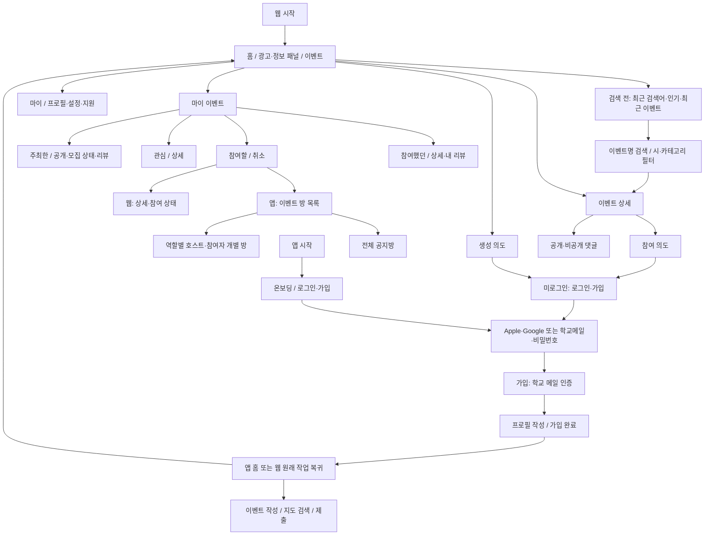

# IA / 정보구조도 — 얼쑤 v0.9

[← 얼쑤 문서 홈](README.md)

> [!abstract]- 문서 목차
> - [플랫폼 구조](02-ia.md#플랫폼-구조)
> - [화면 사전](02-ia.md#화면-사전)
> - [카드와 상세](02-ia.md#카드와-상세)
> - [업로드 화면 상태](02-ia.md#업로드-화면-상태)
> - [마이 메뉴](02-ia.md#마이-메뉴)
> - [예외와 복귀](02-ia.md#예외와-복귀)

> [!info] 등록 즉시 공개
> 게시 전 심사는 제거했다. 모임 작성 → 등록 성공 → 공개 상세/주최 목록으로 이동한다. 관리자 기능은 사후 신고·운영 관리다.

## 플랫폼 구조

앱 하단 탭은 홈·마이 이벤트·채팅·마이. 웹은 홈·마이 이벤트·마이이며 채팅 진입점을 제공하지 않는다. 생성은 홈과 주최한 목록에서 접근할 수 있다. 기존 회원은 학교 인증·프로필 완료 상태에 따라 이미 완료한 단계를 건너뛴다.

## 화면 사전

| 화면 | 내용·주요 동작 | 대상 | 기능 |
|---|---|---|---|
| S01 앱 온보딩 | 서비스 소개·로그인/가입 | 앱 | F01 |
| S02 로그인 | Apple·Google·학교메일/비밀번호, 가입·비밀번호 복구 | 공통 | F02 |
| S03 학교 인증 | 학교 메일 입력·수신 확인, 대학 자동 식별 또는 검색 선택 | 공통 | F03 |
| S04 프로필 작성 | 이름·대학·국적·제1/2언어·성별·관심사 | 공통 | F04 |
| S10 홈 | 팀 info card 패널·이벤트 카드·생성 진입 | 공통 | F05/F06 |
| S11 검색 전 | 최근 검색어·인기/최근 이벤트 | 공통 | F07 |
| S12 검색 결과 | 이벤트명 결과·시/카테고리 필터 | 공통 | F07 |
| S13 이벤트 상세 | 카드 정보+모집 기간·한/영 설명·공개/비공개 댓글·참여 | 공통 | F08/F09/F10 |
| S14 참가 확인 | 본인 정원 그룹·잔여석·신청 결과 | 공통 | F09 |
| S15 이벤트 이용 불가 안내 | 이벤트명·날짜·폐기 사유·팀 문의 | 기존 참가자/호스트 | F20 |
| S20 마이 이벤트 | 참여했던·참여할·관심·주최한 | 공통 | F11 |
| S21 리뷰 | 작성·내 리뷰 보기·수정·삭제 | 공통 | F12 |
| S22 주최 상세 | 공개·모집 상태·종료 후 리뷰 | 호스트 | F13/F14 |
| S23 이벤트 작성 | 내용·한/외 정원·지도 장소 검색, 재작성 허용 시 이전 값 채움 | 호스트 | F13 |
| S30 채팅 이벤트 목록 | 접근 가능한 이벤트만 표시 | 앱 | F15 |
| S31 이벤트 방 목록 | 전체 공지방·역할별 개별 방 | 앱 | F15 |
| S32 채팅방 | 메시지·전송 상태·호스트/메시지 신고 | 앱 | F15/F18 |
| S40 마이 | 아래 마이 하위 메뉴 | 공통 | F04/F16/F17/F18/F19 |
| S90 운영 홈 | 공개 모임·모집·신고·폐기 전달 현황 | 관리자 | F14/F20 |
| S92 신고/폐기 처리 | 신고 조사·조치·공개 사유·전달 실패 재처리 | 관리자 | F18/F20 |
| S93 info card 관리 | 광고/정보·이미지·링크·노출 순서·게시 | 관리자 | F05 |
| S94 지원 관리 | 문의 응답·공지·정책 관리 | 관리자 | F19 |

## 카드와 상세

카드는 썸네일 → 호스트 이름·대학·국적 → 카테고리·이벤트명 → 날짜·장소 → 한국인/외국인 모집 현황 → 관심·신고·모집 중/마감 순으로 구성한다. 카드에서 지도는 지도 열기 동작으로 제공하는 것을 제안한다. 전체 지도를 카드마다 삽입할지는 디자인에서 결정한다.

상세에는 카드 정보를 유지하고 정확한 모집 시작/마감 일시·한/영 설명·댓글을 추가한다. 공개 댓글과 비공개 댓글 작성은 명시적인 가시성 선택을 거친다. 비공개 목록에는 본인 대화만 보이고 호스트는 해당 모임의 비공개 대화를 확인한다.

상세 하단 행동: 참여 전=참여하기, 참여 예정=참여 상태/취소, 참여했던=리뷰 작성하기, 리뷰 작성 완료=내 리뷰 보기, 폐기됨=사유 안내. 참가·리뷰 자격은 서버 판정으로 표시한다.

## 업로드 화면 상태

S23 작성 화면은 파일 선택→Spring Boot 업로드·검증/압축→R2 비공개 저장 완료 후 썸네일을 연결한다. 업로드중·용량/형식 오류·저장 실패·재시도·이미지 교체 상태를 표시한다. 원본 파일 선택만으로 업로드 완료로 취급하지 않는다.

이미지 처리 후 모임 등록이 완료되기 전에는 ‘공개 준비중’을 호스트·관리자에게 표시한다. 일반 목록에는 공개 준비가 끝난 모임만 노출한다. 광고 패널 이미지에도 같은 자산 상태를 적용한다. [이미지 API](05-api-spec.md#이미지-업로드와-공개) 참조.

## 마이 메뉴

- 프로필 정보 → 수정
- 언어 설정 → 한국어/영어 UI
- 신고리스트 → 본인 신고 상세·처리 상태
- Contact → 에헤라디야 팀 문의
- 로그아웃 / 탈퇴
- 알림설정
- 정책 및 약관
- 공지사항 → 공지 상세

## 예외와 복귀

웹의 참여/생성 의도는 인증 중에도 보존한다. 복귀 경로는 서비스 내부 경로만 허용한다. 가입 중 닫으면 탐색으로 돌아갈 수 있고 다시 시도하면 인증·프로필의 완료 상태부터 이어간다.

참여할 이벤트는 앱에서 S31로, 웹에서 S13으로 이동한다. 폐기되면 S15가 우선한다. 인기/최근/필터 결과가 비어 있으면 빈 결과와 초기화 동작을 제공한다. 학교 식별 실패와 일반 메일 거절은 서로 다른 안내를 제공한다.

---

## 연결 문서

- [얼쑤 문서 홈](README.md)
- [얼쑤 PRD](01-prd.md)
- [얼쑤 기능명세서](03-functional-spec.md)
- [얼쑤 ERD](04-erd.md)
- [얼쑤 API 명세서](05-api-spec.md)
- [얼쑤 결정 로그](06-decisions.md)
- [얼쑤 기술 스택·배포](07-tech-stack.md)
