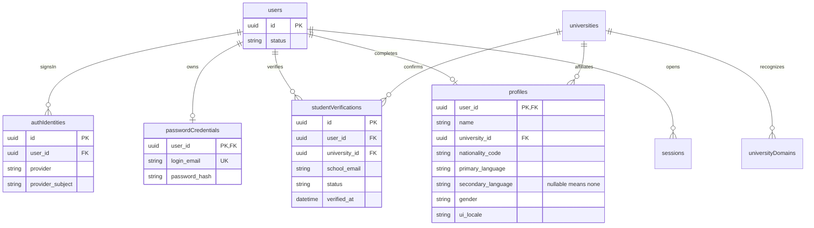
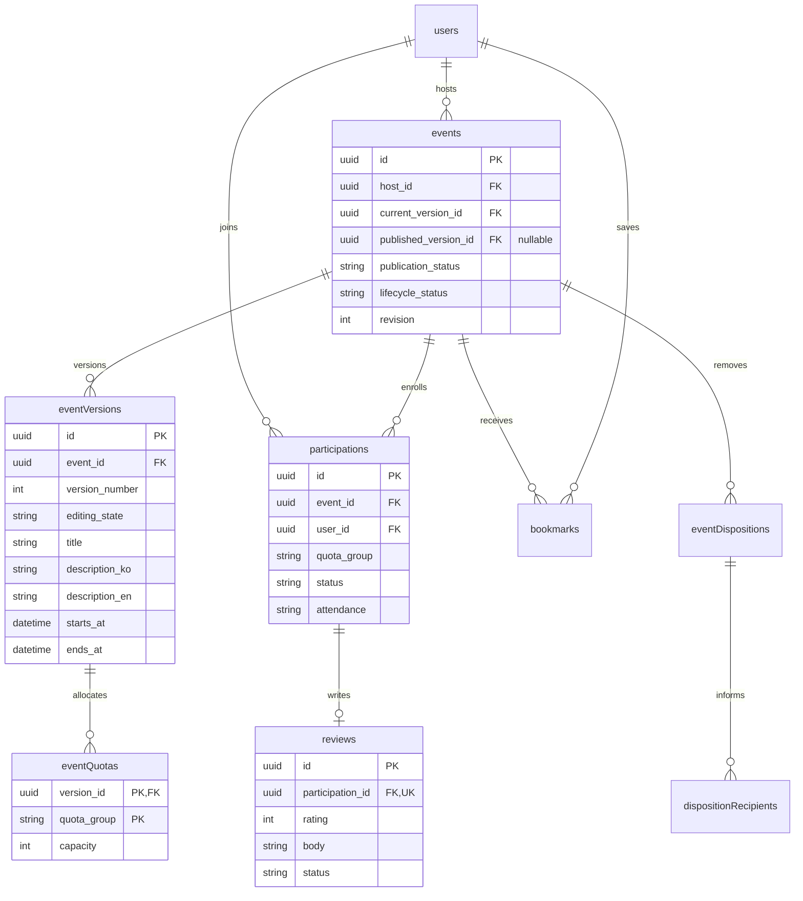
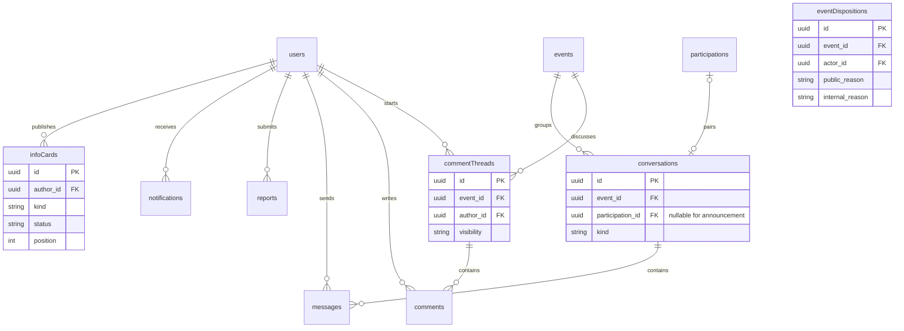

# ERD / 데이터 사전 — 얼쑤 v0.9

[← 얼쑤 문서 홈](README.md)

> [!tip] ERDCloud 가져오기
> [PostgreSQL DDL 파일](04-erd-erdcloud.sql)의 전체 내용을 ERDCloud의 **DDL 가져오기**에 붙여 넣어 시각화한다. 이 SQL은 아래 42개 엔터티와 FK를 담은 **목표 모델**이다. 현재 Spring Boot의 8개 테이블에 적용하는 마이그레이션이 아니므로 운영 DB에서 직접 실행하지 않는다. 가져온 뒤 `events.current_version_id`와 `events.published_version_id`의 순환 참조가 표시되는지 확인한다.

> [!abstract]- 문서 목차
> - [회원·인증](04-erd.md#회원·인증)
> - [이벤트·공개·정원·리뷰](04-erd.md#이벤트·공개·정원·리뷰)
> - [소통·운영](04-erd.md#소통·운영)
> - [데이터 사전](04-erd.md#데이터-사전)
> - [이미지 데이터와 생명주기](04-erd.md#이미지-데이터와-생명주기)
> - [무결성·인덱스·보관](04-erd.md#무결성·인덱스·보관)

> [!note] 논리 모델
> DB는 PostgreSQL을 채택하는 방향이며, Oracle VM의 실제 자원·물리 스키마·마이그레이션은 아직 검증하지 않았다. 개발·운영 DB는 같은 스키마의 별도 인스턴스로 운영하며 실제 데이터와 접근 계정을 공유하지 않는다. 사용자 요구사항을 지원하는 제안 모델이며 ID=UUID, 시각=UTC timestamp로 가정한다. 시간 표시는 이벤트 timezone을 사용한다.

## 회원·인증

users.status=pending/active/suspended/deleted. profiles는 필수값 완료 시 생성하는 안이다. 미완료 작성값은 가입 임시 저장소에서 관리할 수 있다. secondary_language=null은 명시적으로 ‘없음’을 선택한 완료값이며 입력 누락과 UI에서 구분한다.

학교 이메일 수신 검증과 대학 귀속 검증을 분리한다. student_verifications는 pending_email/pending_university/verified/rejected 상태를 갖는다. university_domains에 없는 메일이면 수신 확인만으로 verified가 되지 않는다. 대학 선택 후 운영자 도메인 검증을 거치는 안이다.

## 이벤트·공개·정원·리뷰

> [!info] 게시 전 심사 제거
> publication_status로 공개 여부를 구분한다. event_versions는 향후 수정 이력용 설계이며 심사용 잠금/승인 모델이 아니다. 런타임은 events 한 행에 내용을 저장한다.

버전 참조는 동일 이벤트 소속인지 확인한다. 향후 수정 이력을 추가해도 등록은 즉시 공개하며 심사 데이터는 저장하지 않는다.

## 소통·운영

participations와 conversations의 선택적 1:1은 host_direct 방에만 적용한다. announcement 방의 participation_id는 null이며 event당 하나다. 별도 참가자 간 DM은 없다. 비공개 댓글 스레드와 채팅방은 서로 다른 테이블이며 웹에 채팅을 만들지 않아도 비공개 댓글이 동작한다.

## 데이터 사전

독립 엔터티는 별도 표시가 없으면 id PK·created_at·updated_at을 갖는다. 연결 테이블은 명시된 복합 키를 쓴다. `?`는 nullable. 제출 전 이벤트 내용은 nullable, 제출 시 기능명세의 필수값을 검증한다.

| 테이블 | 주요 필드 | 제약·목적 |
|---|---|---|
| users | status, role | role=member/admin, 클라이언트 변경 불가 |
| auth_identities | user_id, provider, provider_subject | UNIQUE(provider,provider_subject), provider=apple/google |
| password_credentials | user_id PK/FK, login_email, password_hash | email UNIQUE, 소셜 전용 계정은 행 없음 |
| sessions | user_id, refresh_hash, expires_at, revoked_at? | 로그인 세션·갱신 토큰 회전 |
| verification_challenges | purpose, user_id?, email, code_hash, expires_at, attempts, consumed_at? | purpose=school_email/password_reset, 일회용 |
| student_verifications | user_id, school_email, university_id?, status, email_verified_at?, verified_at?, domain_verified_by? | 활성 학교메일은 사용자 간 중복 불가 제안, 이력 보존 |
| universities | name_ko, name_en, active | 한국 소재 대학 사전 |
| university_domains | domain PK, university_id FK, verified_by, verified_at | 같은 도메인의 다중 대학 지원 필요 시 매핑 확장 |
| profiles | user_id PK/FK, name, university_id, nationality_code, primary_language, secondary_language?, gender, ui_locale | 필수 프로필 완료 후 생성 |
| profile_interests | user_id FK, interest_code | 복합 PK, 선택 입력 |
| cities | code PK, official_name, display_name_ko, display_name_en | 정규 코드와 짧은 표시명 분리 |
| categories | id, code UNIQUE, name_ko, name_en | 검색·행사 분류 |
| events | host_id, current_version_id, published_version_id?, publication_status, lifecycle_status, revision, published_at? | published 게시만 탐색, removed는 사유 조회로 대체 |
| event_versions | event_id, version_number, editing_state, title?, thumbnail_asset_id?, category_id?, city_code?, venue_name?, address?, latitude?, longitude?, place_provider?, provider_place_id?, starts_at?, ends_at?, timezone, recruitment_start?, recruitment_end?, description_ko?, description_en?, saved_at? | UNIQUE(event_id,version_number), editing/published. 수정 이력용 설계 |
| event_quotas | version_id FK, quota_group, capacity | PK(version_id,quota_group), korean/international 두 행, capacity≥0 |
| participations | event_id, user_id, quota_group, nationality_snapshot, status, attendance, confirmed_at, cancelled_at?, cancellation_source? | UNIQUE(event_id,user_id). 그룹은 서버 판정 후 스냅샷 |
| participation_history | participation_id, actor_id?, action, reason?, created_at | 신청·취소·국적 관련 정정·출석 변경 이력 |
| bookmarks | user_id FK, event_id FK | 복합 PK |
| comment_threads | event_id, author_id, visibility, status | public/private, private 가시성 변경 불가 제안 |
| comments | thread_id, author_id, body, status | 첫 질문과 답변 모두 같은 스레드, visible/hidden/deleted |
| conversations | event_id, kind, participation_id? | announcement event당 UNIQUE, host_direct participation_id UNIQUE |
| messages | conversation_id, sender_id, client_message_id, body, status | UNIQUE(sender_id,client_message_id) |
| conversation_reads | conversation_id, user_id, last_read_message_id? | 복합 PK, 같은 방의 메시지만 참조 |
| reviews | participation_id UNIQUE, rating, body, status, revision, deleted_at? | 별점 1~5, visible/hidden/deleted. 본인 수정·삭제 |
| review_history | review_id, action, prior_body?, actor_id, created_at | 수정·삭제 이력, 보관 정책 미정 |
| event_dispositions | event_id, actor_id, kind, public_reason, internal_reason?, created_at | kind=cancelled/removed, 사후 운영 조치 |
| disposition_recipients | disposition_id, user_id, event_title_snapshot, starts_at_snapshot, delivered_at?, read_at? | 복합 PK, 알림 채널 실패와 무관하게 안내 유지 |
| reports | reporter_id, target_type, target_id, reason_code, description?, evidence_snapshot?, status, resolution?, resolved_by? | 대상별 존재/접근 검증, 신고자의 신원 비공개 |
| notifications | user_id, type, target_type, target_id, dedupe_key UNIQUE, read_at? | 메시지·폐기·운영 안내 |
| notification_settings | user_id PK/FK, push_enabled, chat_enabled | 앱 권한과 OS 권한 분리 |
| device_tokens | user_id, session_id, token UNIQUE, platform, enabled | 로그아웃 기기·탈퇴 전체 연결 폐기 |
| info_cards | author_id, kind, title_ko, title_en?, body_ko?, body_en?, image_asset_id?, target_url?, position, status, starts_at?, ends_at?, revision | kind=ad/information/other, draft/published/archived |
| support_tickets | user_id, subject, body, status, reply?, replied_by?, replied_at? | 본인·팀만 접근 |
| announcements | title_ko, title_en?, body_ko, body_en?, published_at?, author_id | 마이 공지. 이벤트 공지 채팅과 별개 |
| policy_versions | document_type, version, locale, body, effective_at, required | UNIQUE(type,version,locale), 발행 후 불변 |
| consents | user_id, policy_version_id, accepted_at | 복합 PK |
| media_assets | owner_id FK, purpose, source_checksum, status, publication_status, failure_code?, created_at, updated_at | processing/ready/failed, private/publishing/public/revoking |
| media_variants | asset_id FK, kind, private_bucket, private_key, public_bucket?, public_key?, content_type, width, height, size_bytes | PK(asset_id,kind), kind=card/detail, 비공개·공개 객체 모두 추적 |
| outbox | topic, aggregate_id, payload, dedupe_key UNIQUE, status, attempts, next_attempt_at? | 전달 재시도, 비공개 본문 최소화 |
| idempotency_records | user_id, method, path, key, request_hash, response, expires_at | UNIQUE(user,method,path,key) |
| audit_logs | actor_id, action, target_type, target_id, reason?, created_at | 폐기·신고 조사·관리자 변경 이력 |

## 이미지 데이터와 생명주기

`users 1:N media_assets`, `media_assets 1:N media_variants`, `event_versions N:1 media_assets`(thumbnail_asset_id), `info_cards N:1 media_assets`(image_asset_id) 관계다. 실제 파일은 Cloudflare R2, DB는 소유자·처리 상태·경로·크기·연결을 보관한다. 썸네일은 카드/상세 두 variant를 갖는다. 게시 준비를 포함한 전체 업로드 계약은 [이미지 API](05-api-spec.md#이미지-업로드와-공개)를 따른다.

원본은 검증·변환용 임시 파일로 사용하고 처리 완료 후 삭제하는 기본안이다. 수정 이력에 필요한 것은 해당 버전이 참조하는 처리본이다. 이전 제출본이 참조하면 미사용 파일로 삭제하지 않는다. 사용하지 않은 처리본·실패한 업로드·임시 원본 정리 주기는 별도 결정한다.

PostgreSQL과 R2 사이에는 분산 트랜잭션이 없으므로 processing→ready, private→publishing→public 전환과 outbox를 통해 재시도한다. 파일 쓰기 성공 후 DB 확정 실패한 부분 객체도 추적·정리한다. 이벤트가 published·active이고 썸네일이 ready·public일 때만 탐색에 노출한다. 게시 취소와 이미지 공개 작업은 event 버전 및 운영 상태를 재검사하여 순서 역전으로 재노출되지 않게 한다.

## 무결성·인덱스·보관

정원 제한은 published_version의 그룹별 capacity와 confirmed 참가 수를 같은 이벤트 잠금 안에서 검사한다. DB 행 CHECK만으로 참가 수 제한을 보장하지 못한다. 신청·취소·폐기는 같은 잠금 순서를 사용한다.

conversations.participation_id의 event_id 일치, messages/read 위치의 같은 방 여부, event.current/published_version 소속을 복합 FK 또는 트랜잭션으로 검증한다. 비공개 댓글 권한은 요청자=thread.author 또는 event.host로 계산한다. 공지방 쓰기는 event.host만 가능하다.

인덱스 후보: events(status,published_at,id), event_versions(city_code,category_id,starts_at), participations(event_id,quota_group,status), participations(user_id,status), comments(thread_id,created_at,id), messages(conversation_id,created_at,id), disposition_recipients(user_id,read_at), reports(status,created_at), outbox(status,next_attempt_at).

최근 검색어는 초기에는 기기 로컬 저장 제안이므로 사용자 DB 테이블을 두지 않는다. 인기 집계 저장소는 계산 기준 확정 후 추가한다. 제품 실험 계측 저장소도 추가 회의 후 정의한다.

폐기는 이벤트 물리 삭제가 아니다. 참가자가 사유를 조회할 수 있어야 한다. 현재 MVP 탈퇴는 계정·활동 삭제, 댓글 내용·작성자 연결 제거, 주최자 정보 제거를 구현했다. 모임 내용·이미지와 타 회원 활동은 유지하며, 상세는 [계정 관리 기록](16-account-management.md)를 따른다. 확장 설계의 개인정보·메시지·신고 증거·사유 기록 및 백업·외부 로그의 보관 기간은 별도 결정한다. 모든 FK를 cascade 삭제하는 방식은 채택하지 않는다.

---

## 연결 문서

- [얼쑤 문서 홈](README.md)
- [얼쑤 PRD](01-prd.md)
- [얼쑤 정보구조도](02-ia.md)
- [얼쑤 기능명세서](03-functional-spec.md)
- [얼쑤 API 명세서](05-api-spec.md)
- [얼쑤 결정 로그](06-decisions.md)
- [얼쑤 기술 스택·배포](07-tech-stack.md)

## 현재 로컬 데이터 모델 메모 (2026-09-30)

> [!info] 시연 구현과 목표 ERD 구분
> 로컬 Spring Boot는 `events.demo_joinable`, `event_comments`, `event_favorites`, `event_participations`, `event_reviews`, `content_reports` 테이블을 Hibernate `update`로 사용한다. 목표 ERD의 이벤트 버전·출석·운영 감사·알림/전달 이력을 모두 구현한 상태는 아니다. 운영 환경에는 검토된 DB 마이그레이션이 필요하다.

- `event_comments`: 모임·작성자·공개 범위(`public`/`host_only`)·답글 부모·삭제 시각. 비공개 댓글은 작성자와 호스트의 대화로 제한한다.
- `event_favorites`: 회원·모임의 유일 조합. 관심 등록/해제에 사용한다.
- `event_participations`: 회원·모임의 유일 조합, 한/국제학생 정원 그룹과 `active`/`cancelled` 상태. 샘플 3개는 실제 예약 없는 데모 참여다.
- `event_reviews`: 회원·모임당 한 건. 현재는 실제 출석이 아닌 시작 후 활성 참여 이력으로 작성 자격을 판정한다.
- `content_reports`: 신고자·모임·대상 종류(`event`/`comment`)·사유·설명·`open`/`resolved`/`dismissed` 상태. 시연용 검토 화면에서만 처리한다.

> [!info] 실제 구현과 구조
> 설계와 현재 코드의 차이는 [작업 현황과 다음 개발](08-work-status.md), 실제 패키지·동작·런타임 DB는 [백엔드 아키텍처](09-backend-architecture.md)에서 확인한다.
